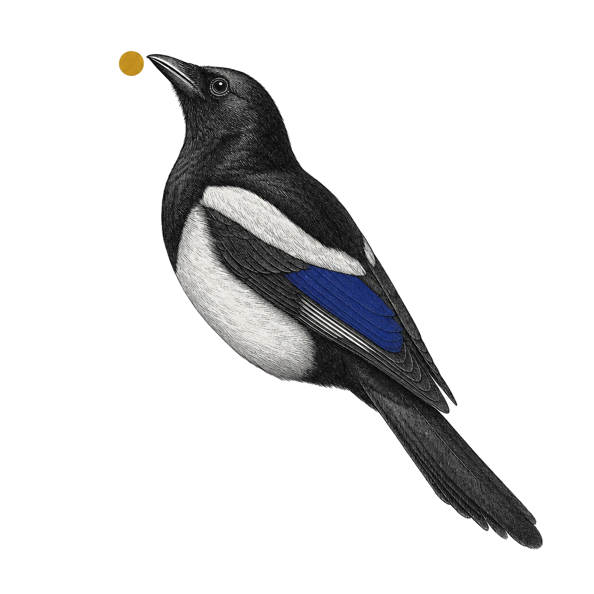

<p align="center">
  
</p>

<h1 align="center">Magpie</h1>

<p align="center"><em>Your loyal Magpie.<br />Lands every visual in the nest.</em></p>

Local dashboard + embedded MCP server. Your AI agent writes HTML, Mermaid, SVG, Markdown, Graphviz/DOT, Vega-Lite, D2, status reports, ADRs, plans — Magpie lands them in a gallery you can browse. Library, projects, tags, versions, side-by-side compare, source attribution. One install, two surfaces (MCP tools + browser dashboard).

<div align="center">

[](https://www.npmjs.com/package/magpie-mcp) [](LICENSE) [](#install) [](https://github.com/omerb784/magpie-mcp/actions)

</div>

## What it is

> Your LLM gives you chat history. Magpie gives you a gallery your AI curates for you.

A dumb organizer with smart producers. Your AI coding agent (or Stitch, Figma, Mermaid Chart, SVGMaker, Icons8 over MCP) does the creative work; Magpie files it, tags it, versions it, attributes it, and lets you browse every non-code thing your AI ever made for you — across sessions, in a real grid UI.

## What it isn't

- **Not a generator** — no LLM in the server. Your AI writes the content.
- **Not a whiteboard** — no infinite canvas, no drawing, no real-time collab.
- **Not cloud** — everything lives at `~/.magpie/` on your disk. Zero telemetry.
- **Not collaborative** — single user, single machine, by design.
- **Not freemium** — MIT open source. No paid tier exists or is planned.

## Three actors · one nest

Magpie's story is three named roles. You're the reader they all serve.

| Actor | What | Sticky line |
|---|---|---|
| **Master** · the trainer | A portable Agent Skill bundled in the npm tarball at `skill/magpie-master/SKILL.md`. Pure judgment — picks projects, decides iterate vs add, asks before filing when uncertain. No code, no storage. | *Teaches your AI Magpie's rules.* |
| **Magpie** · the trained bird | Your AI coding agent (Cursor, Cline, etc.) with the Master skill loaded. Brings visuals to the Nest, arranges them by project, keeps versions in order. | *Tends the nest, version after version.* |
| **Nest** · the dumb infra | One SQLite file. One blobs folder. Lives at `~/.magpie/` on your disk. Holds what your Magpie brings. No LLM. No telemetry. Never phones home. | *Local. Quiet. Yours.* |

> *Master trains · Magpie tends · Nest keeps.*

**Infra is dumb. That's the point.** The server has no model. Decisions happen on the host side, inside the trained AI. Dumb infrastructure is small (~200KB pre-deps), fast (sync SQLite · sub-ms search), auditable (TypeScript strict · raw SQL · MIT), and impossible to compromise in interesting ways. See [`SECURITY.md`](SECURITY.md) for the threat model.

## Supported formats

| Type | Ext | Renderer | Use for |
|---|---|---|---|
| `html` | `.html` | iframe (raw) | UI mockups, dashboards, landing pages |
| `mermaid` | `.mmd` | bundled Mermaid v11 → SVG | flowcharts, sequence, state, ER, gantt |
| `svg` | `.svg` | iframe (raw) | icons, logos, single vector elements |
| `markdown` | `.md` | `marked` + DOMPurify → sanitized HTML | prose, READMEs, design notes, specs |
| `dot` | `.dot` | `@hpcc-js/wasm-graphviz` (WASM Graphviz) → SVG | Graphviz directed/undirected graphs |
| `vega-lite` | `.vl.json` | `vega-lite` + `vega` → SVG | charts, data viz (bar / line / scatter / area). Inline data via `data.values`; remote `data.url` rejected. |
| `d2` | `.d2` | `@terrastruct/d2` (WASM) → SVG | modern text-to-diagram diagrams (dagre / elk layouts) |

All renderers run offline. No JVM, no native binaries, no remote calls.

## Install

```bash
npx magpie-mcp
```

Or globally:

```bash
npm install -g magpie-mcp
magpie-mcp
```

Requires Node ≥20 and a system Chrome / Chromium install (Magpie uses `puppeteer-core` against your existing browser — no 200 MB download).

On first run Magpie starts two listeners:
1. **MCP stdio** — your AI coding agent connects via your config (below).
2. **HTTP + WebSocket** — dashboard at `http://localhost:3737` (auto-bumps if taken).

Open the URL. Keep the terminal running. From any other terminal, `npx magpie` re-opens the dashboard against the last running port.

## Configure your MCP host

Generate the snippet:

```bash
npx magpie-mcp --print-config
```

Paste into Claude Desktop or Claude Code config:

```json
{
  "mcpServers": {
    "magpie": {
      "command": "npx",
      "args": ["-y", "magpie-mcp"]
    }
  }
}
```

Restart your host. Magpie's tools and resources should appear.

## Install the master skill (v0.9.1+)

Magpie ships with an Agent Skill that teaches your AI coding agent *when* to file silently, *when* to iterate, and *when* to stop and ask you about new projects or ambiguous matches. The skill is opt-in:

```bash
npx magpie-mcp --install-skill
```

This copies `magpie-master/SKILL.md` into `~/.claude/skills/magpie-master/`. Your AI coding agent loads it on-demand when triggered by the keywords `magpie`, `magpie-mcp`, `add_visual`, `iterate`, or `nest`. The skill defers to your existing instructions for everything else.

Already installed? `--install-skill` is idempotent:

- Same hash as bundled → no-op.
- Older version installed → upgraded cleanly.
- Same version with local edits → refuses with a diff hint. Re-run with `--force` to overwrite.

The MCP server's `instructions` string carries the same protocol as a layered fallback, so hosts without the skill loaded keep working — just without the skill's on-demand context.

Cursor + Cline auto-install is not supported in v0.9.1. Manual install (copy the bundled `SKILL.md` into your host's skill directory) works for any host that reads markdown skills.

## First visual

In your AI coding agent:

> *"Mock me a CRM dashboard for sales reps."*

Your AI coding agent writes HTML → calls `add_visual` → Magpie saves, renders a thumbnail, returns a preview URL. Click it. Tag it. Star it.

> *"Make it dark mode."*

Your AI coding agent calls `iterate` → v2 added to the same visual. Compare v1 vs v2 side-by-side from the dashboard.

## Dashboard tour

- **Sidebar** — projects (active + Starred + Show archived toggle). Right-click a project to rename / archive / merge.
- **Grid** — thumbnail card per visual. Click for the detail drawer.
- **Detail drawer** — full preview, version list, tags editor (× chips + "+" input), star toggle, archive / restore, per-version re-render on failed.
- **Compare URL** — `/compare/:id?a=N&b=M` opens side-by-side iframes for any two versions.
- **Header search** — debounced full-library title search.
- **Empty state** — landing card with the `--print-config` snippet pre-baked.

The dashboard auto-refreshes via WebSocket when your AI coding agent adds, iterates, or archives. A "Reconnecting…" banner appears if the connection drops.

## Tools reference

14 tools. No deletes via MCP — hard deletes are UI-only by design.

| Tool | Purpose |
|---|---|
| `create_project(name, type)` | Set up an empty project. Optional — `add_visual` auto-creates. |
| `add_visual(project, type, content \| content_path, title?, tags?, source?)` | Save new HTML / Mermaid / SVG / Markdown / DOT / Vega-Lite / D2 with optional provenance. Pass exactly one of `content` (inline) or `content_path` (absolute file path under the project root); prefer `content_path` for anything > a few KB to save tokens. |
| `iterate(visual_id, content \| content_path, message?, description?)` | Append a new version with the full updated content. Optional `description` for long-form rationale shown in version history. Same `content` / `content_path` rules as `add_visual` — for iterate especially, prefer `content_path` since regenerating full content inline burns tokens fast. |
| `list_projects()` | List active projects + visual counts. |
| `list_versions(visual_id)` | History of a single visual. |
| `find_visuals(query?, project?, tags?, type?, source?, starred?, match_description?)` | Search / filter the library (AND-style). Multiple tags compose AND. `tag` (singular) accepted as deprecated alias. |
| `compare(visual_id, a?, b?)` | Return a compare URL. Defaults to `current_ver-1` vs `current_ver`. |
| `open_preview(visual_id, version?)` | Get the dashboard URL for an existing visual. |
| `update_visual(visual_id, title?, tags?, starred?, description?)` | Rename / replace tag set / toggle star / set description. |
| `update_project(name, new_name?, description?)` | Rename a project and/or update its description (rejects name conflicts). |
| `archive_visual(visual_id)` | Hide a visual from default views. |
| `archive_project(name)` | Hide a project from default views. |
| `merge_projects(src_name, dst_name)` | Move all visuals into `dst` and archive `src`. |
| `read_inbox(since?)` | Pull recent dashboard activity (sends to agent, comments, picks) for warm session handoff. |

All tools return plain text. Preview URLs come back in the response so you can click straight to the dashboard.

## Resources reference

For inspecting library state without driving tools:

| URI | Returns |
|---|---|
| `magpie://library` | All non-archived projects + counts (JSON). |
| `magpie://project/{name}` | Visuals in a project (id, title, type, current_ver, tags) (JSON). |
| `magpie://visual/{id}` or `magpie://visual/{id}/v{n}` | Raw saved content. mimeType = `text/html`, `image/svg+xml`, `text/x-mermaid`, `text/markdown`, `text/vnd.graphviz`, `application/vnd.vega.v5+json`, or `text/x-d2`. |

## Export

Dashboard-only. Your AI coding agent doesn't drive downloads — open the dashboard and click.

| What | Where | Notes |
|---|---|---|
| Source blob (HTML / Mermaid / SVG / Markdown / DOT / `.vl.json` / `.d2`) | Drawer → **Download** → Source | Pick any version from the version dropdown first. |
| Thumbnail PNG | Drawer → **Download** → Thumbnail (PNG) | Disabled if the version's render isn't `ok`. |
| Rendered SVG | Drawer → **Download** → Rendered SVG | Available for `svg`, `dot`, `vega-lite`, `d2`. Mermaid needs a browser to compile — limitation, see CHANGELOG. |
| Whole project as zip | Sidebar → project context menu → **Export as zip…** | Chooser: **Current versions only** (default) or **All versions**. Zip includes `manifest.json`, per-visual `meta.json`, source blobs, and thumbs (when render is `ok`). |

REST endpoints powering the above (read-only, offline):

- `GET /api/visuals/:id/source[?ver=N]`
- `GET /api/visuals/:id/render.svg[?ver=N]` (415 on `html` / `markdown` / `mermaid`)
- `GET /thumbs/:id/v:n.png?download=1` (without `?download`, inline as before)
- `GET /api/projects/:name/export.zip[?versions=current|all]` (413 if zip > 1GB)

## Recommended pairings

Pair Magpie with the master skill plus any visual MCP:

| Pairing | What it adds |
|---|---|
| **`magpie-master` skill** (bundled) | The master decision protocol — when to iterate vs add, when to stop and ask about new projects. Install via `npx magpie-mcp --install-skill`. See above. |
| [Stitch](https://github.com/Kargatharaakash/stitch-mcp) (text → UI) | `add_visual(type='html', source='stitch')` |
| [Mermaid Chart MCP](https://mermaid.ai/docs/ai/mcp-server) | `add_visual(type='mermaid', source='mermaid-chart')` |
| [Figma MCP](https://help.figma.com/hc/en-us/articles/32132100833559-Guide-to-the-Figma-MCP-server) | `add_visual(type='html', source='figma')` |
| [SVGMaker](https://github.com/GenWaveLLC/svgmaker-mcp) | `add_visual(type='svg', source='svgmaker')` |
| [Icons8 MCP](https://icons8.com/mcp) | `add_visual(type='svg', source='icons8')` |

Magpie never calls generators or fetches URLs. Your AI coding agent orchestrates: skill (when) + generator (what) → Magpie (where).

## FAQ

**Where is my data stored?**
`~/.magpie/db.sqlite` (metadata, WAL journal mode) + `~/.magpie/blobs/<id>/v<n>.{html,mmd,svg,md,dot,vl.json,d2,png}` (content + thumbnails). Override with `MAGPIE_HOME`.

**Can I sync between machines?**
Copy `~/.magpie/`. The directory is portable. There's no built-in cloud sync — by design.

**Does it need Chrome?**
Yes. `puppeteer-core` uses your system Chrome / Chromium for thumbnail rendering. Set `MAGPIE_CHROME_PATH` if auto-detect fails.

**Why no delete tool?**
Hard deletes are intentionally UI-only. The MCP surface only archives. This makes destructive actions a deliberate human choice, not an LLM tool call.

**Is there telemetry?**
Zero. No phone home. No version checks. No analytics. Forever.

**Why not Electron?**
Bundled web only. The browser tab is the UI — a locked architectural decision.

**Why "Magpie"?**
Magpies are famous for collecting shiny objects and storing them in their nest. That's exactly what this app does for every visual your AI agent authors — your loyal Magpie lands the mockups, diagrams, charts, reports, plans, and references your AI coding agent (Cursor, Cline, etc.) produces and keeps them organized in one place.

## Process model — one canonical Magpie per machine

Magpie runs **one canonical process per `MAGPIE_HOME`**, with N facades. The first process to bind the IPC pipe at `$MAGPIE_HOME/magpie.pipe-*` becomes canonical and owns HTTP, SQLite, blob writes, and the render queue. Subsequent processes (a second AI coding agent session, Cursor, Claude Desktop) detect the bound pipe and become facades — they own the stdio pipe to their host and forward MCP traffic to the canonical over IPC. When the canonical dies, exactly one facade wins the race to bind and becomes the new canonical (re-binding the previous HTTP port so the dashboard URL doesn't change).

You'll see one of three banners on stderr at boot:

- `[magpie] canonical pid=12345 ipc=\\.\pipe\magpie-...` — first process; bound the pipe.
- `[magpie] connected as facade to canonical pid=99999 ipc=... http=:3737` — another canonical exists; this process is a facade.
- `[magpie] promoted to canonical pid=12345 ... (prev httpPort=3737)` — was a facade; canonical died; this process won the promotion race.

**Windows AV note:** Defender real-time scanning adds ~1-3% overhead to test runs on a default install. Add `$PWD` and `$env:MAGPIE_HOME` as `Add-MpPreference -ExclusionPath` entries if you're running benchmarks. See `scripts/measure-av-overhead.mjs` for the measurement harness.

## Back up your nest

Magpie stores everything in `~/.magpie/` (or wherever `MAGPIE_HOME` points):
`db.sqlite` (metadata) + `blobs/<visual_id>/v<N>.<ext>` (content) + `last-port`. To back up your nest, stop Magpie first, then snapshot the directory.

**Cold copy (recommended):**

```bash
# 1. Stop Magpie. Quit the host that launched it (Claude Code / Desktop / Cursor).
#    Or kill the process directly:
pkill -f magpie-mcp              # macOS / Linux
# Stop-Process -Name node        # Windows PowerShell — match your Magpie node.exe pid

# 2. Snapshot the directory.
tar -czf magpie-backup-$(date +%F).tar.gz -C ~ .magpie

# 3. Verify the archive is non-empty.
tar -tzf magpie-backup-*.tar.gz | head
```

**Restore:**

```bash
# 1. Stop Magpie (as above).
# 2. Move the existing dir aside (don't delete until restore is verified).
mv ~/.magpie ~/.magpie.pre-restore

# 3. Extract the backup.
tar -xzf magpie-backup-2026-05-14.tar.gz -C ~

# 4. Boot Magpie. If it opens cleanly and your projects show up, remove the staging dir.
rm -rf ~/.magpie.pre-restore
```

**WAL note.** SQLite's WAL mode means `db.sqlite` is paired with transient `db.sqlite-wal` and `db.sqlite-shm` files. The cold-copy above captures the whole directory atomically, which is safe as long as Magpie is stopped first. **Never copy `db.sqlite` alone while Magpie is running** — you'll get a partial snapshot.

**Hot backup (v0.9.3+):**

```bash
magpie-mcp --backup ~/magpie-backup-$(date +%F).tar.gz
```

WAL checkpoint + atomic tar without stopping Magpie. Refuses to overwrite by default; pass `--force` to overwrite an existing file. USTAR + gzip · zero new dependencies.

## Where files live

Three locations matter:

1. **The nest** — `MAGPIE_HOME` (default `~/.magpie/`). SQLite + blobs. Per-user, never in git, never in npm tarball.
2. **Your source files** — wherever you put them. Magpie **NEVER moves, edits, or deletes** them. `content_path` is **read + copy only** — bytes are copied into the next blob slot; the original stays exactly where it was.
3. **The skill** — `~/.claude/skills/magpie-master/SKILL.md`, installed by `npx magpie-mcp --install-skill` (5-outcome idempotent).

Open `/guide#filesystem` in the dashboard for the full tree + per-scenario policy table.

## Environment

| Var | Default | Purpose |
|---|---|---|
| `MAGPIE_HOME` | `~/.magpie` | Storage root. |
| `MAGPIE_PORT` | `3737` | Preferred HTTP port (auto-bumps if taken). |
| `MAGPIE_BIND` | `127.0.0.1` | HTTP bind address. |
| `MAGPIE_CHROME_PATH` | _auto-detect_ | Explicit Chrome binary path. |
| `MAGPIE_CONTENT_ROOT` | `process.cwd()` | Allowed root for `content_path` reads. Override only when the MCP host launches Magpie from a non-project cwd (e.g. Claude Desktop). |

CLI flags: `--print-config`, `--version`, `--help`.

## Stack

TypeScript strict · Node 20+ · MCP SDK · Hono + ws · React + Vite · `better-sqlite3` · `puppeteer-core` · bundled Mermaid v11 · `marked` + DOMPurify · `@hpcc-js/wasm-graphviz` · `vega-lite` + `vega` · `@terrastruct/d2`.

## Develop

```bash
git clone https://github.com/omerb784/magpie-mcp.git
cd magpie-mcp
npm install
npm run dev          # tsx watch on server, vite dev for UI on :5273
npm test             # vitest
npm run typecheck
npm run build        # compile server + bundle UI into dist/
npm start            # run from dist/
```

UI dev runs on `:5273` and proxies `/api` + `/ws` to the server (port `3838`, set in `.env.dev`).

## Contributing

PRs welcome — please open an issue first for non-trivial changes. To keep the scope tight, these are deliberately **out of scope** and won't be merged: an LLM in the server, MCP Apps / iframe-in-chat, an Electron or native shell, cloud sync or share links, AI auto-tagging, and multi-user / accounts. Magpie organizes AI-authored visuals; it does not generate them. For security issues, see [`SECURITY.md`](SECURITY.md).

## Security

Magpie is a local-only process. It opens loopback ports (127.0.0.1), reads/writes inside `~/.magpie/`, and exposes one stdio MCP transport to its host. No outbound network calls. See [`SECURITY.md`](SECURITY.md) for the full threat model, listener inventory, sandboxing, and how to report a vulnerability.

## License

MIT. © 2026 Omer BarOr.

## Changelog

See [`CHANGELOG.md`](CHANGELOG.md) for the full release history. Versioned per [Semantic Versioning](https://semver.org/spec/v2.0.0.html).
